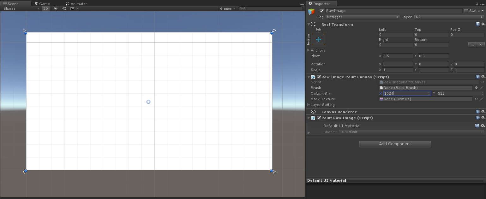
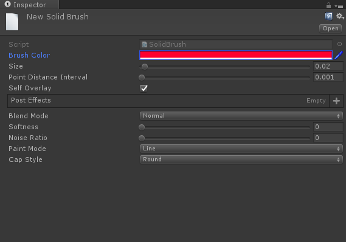
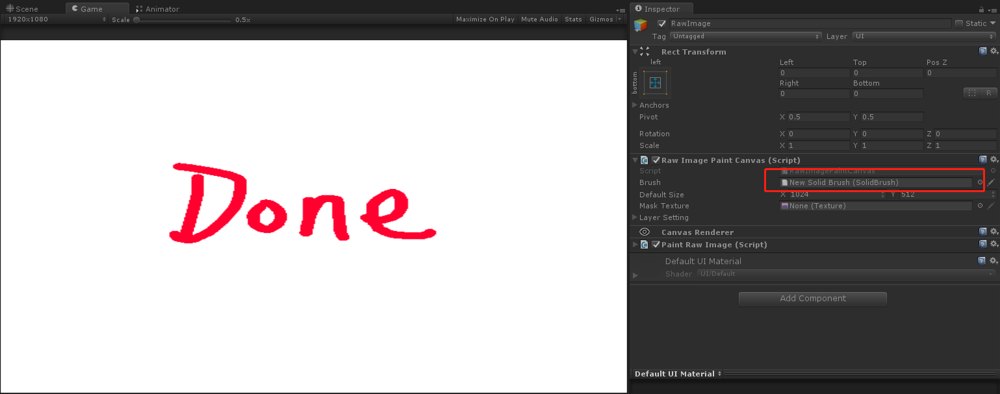
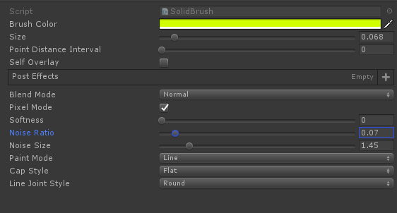
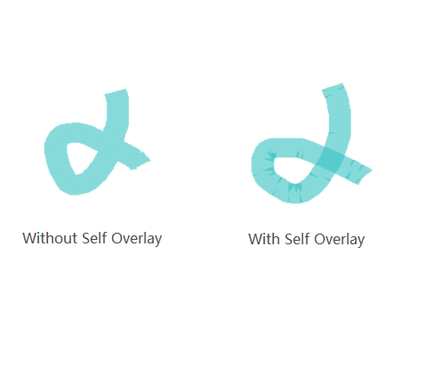
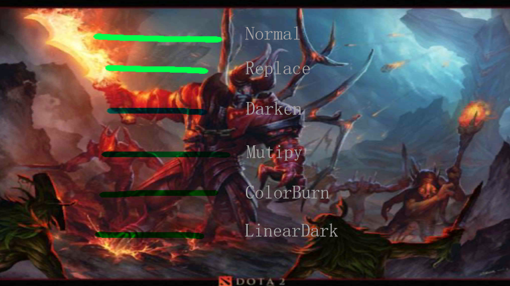
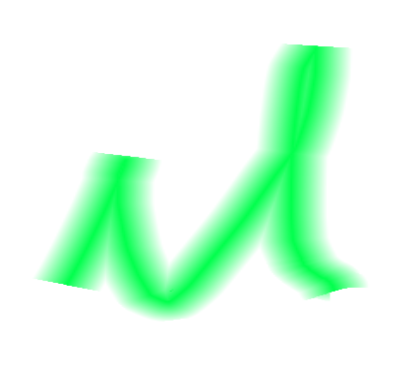
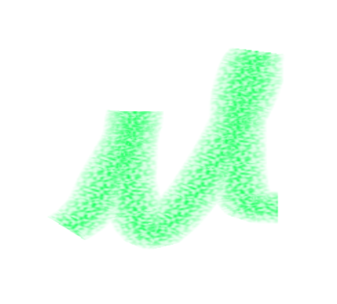

# 1. Introduction
> You can use right now on:  
> [Online Demo](https://wingcd.github.io/upainter-demo/samples/)

This is a texture paint toolset,you can use in Unity RawImage/Mesh Texture/Unity Edtior UI/other UI system;

  </img>
  
 Raw Image

  </img>
  
 Draw on mesh

  </img>
  
 Draw in editor

## Features
* Paint in runtime
* Paint in editor mode
* Paint in GPU
* Solid brush
* Texture brush
* Graphic brush
* Composite brush
* Fill Tool
* More blend type
* Post effect
* Undo/Redo
# 2. Quick Start
## Use Samples
* Open demo scene "uPainter/Samples/Samples.unity" 
* Click one sample
* Draw on canvas
## How to use 
* Create a new scene
* Add a Empty Object in Canvas, and stretch to fit size

  </img>
  
 Create Empty GameObject

* Add RawImagePaintCanvas to this 

  </img>
  
 Add RawImagePaintCanvas component

* Create a solid brush:in assets window, click right mouse button, select in path "Create/uPainter/SolidBrush"
* Modify brush's attributes

  </img>
  
 Create solid brush

* Assign the solid brush to RawImagePaintCanvs's "Brush" property
* Draw on canvas

  </img>
  
 Assign brush & Draw

# 3. Details Introduce
## Solid brush 
Paint solid color to texture

  </img>
  
 Solid brush

> <b>Brush Color:</b> color of brush  
> <b>Size:</b> size of brush,value Range(0,1) 
> <b>Point Distance Interval:</b> the minimum distance of last two points  
> <b>Self Overlay:</b> whether or not overlay self in on paint life circle    
> 
  
>  </img>  
>    
> Self Overlay  
> 
  
>  
> <b>Blend Mode:</b> blend type with layer texture
> * Normal: Default mode  
> * Restore: Easer use this mode  
> * Replace: Scratch card use this mode  
> * Darken  
> * Mutipy  
> * ColorBurn  
> * LinearDark  
> * Lighten  
> * ColorScreen  
> * ColorDodge  
> * LinearDodge  
> * Overlay  
> * HardLight  
> * SoftLight  
> * VividLight  
> * PinLight  
> * LinearLight  
> * HardMix  
> * Difference  
> * Exclusion  
> * Subtract  
> * Add  
>  
> 
  
>  </img>  
>    
> Some blend modes  
> 
 
>  
> <b>Softness:</b> softness of brush, value Range(0,1),default is 0>  
> 
  
>  </img>  
>    
> Softness
> 
 
>  
> <b>Noise Rate:</b> mask brush with noise, can use this property to simulation uneven effect,such as crayon pen, only value bigger than 0 can be effective,value Range(0,1)
> <b>Noise Size:</b> set the noise size, only noise rate bigger than 0 can be effective,value Range(0,1)  
> 
  
>  </img>  
>    
> Noise
> 
 
>  

## Texture brush
## Graphic brush
## Composite brush
## Post effect
## Undo/Redo