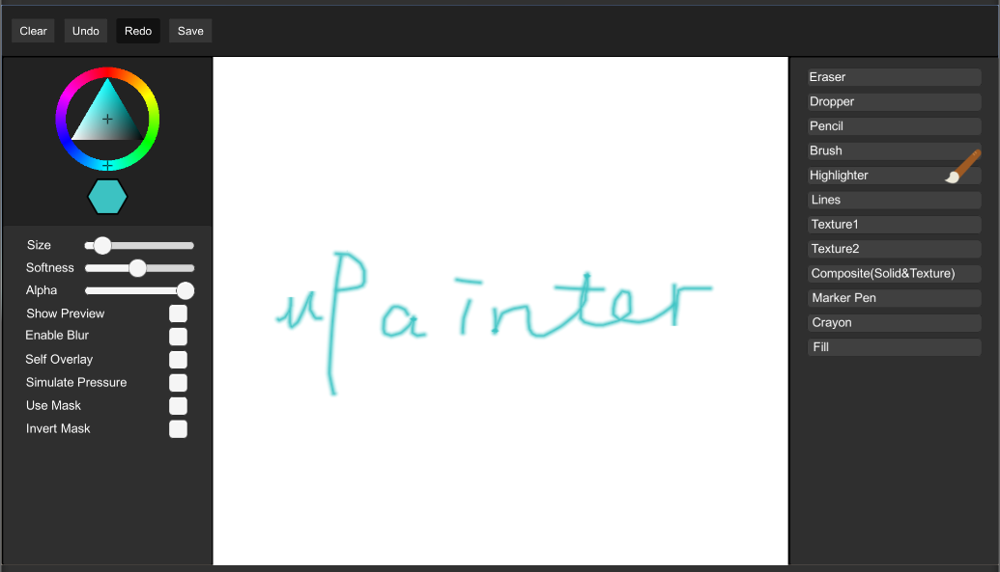
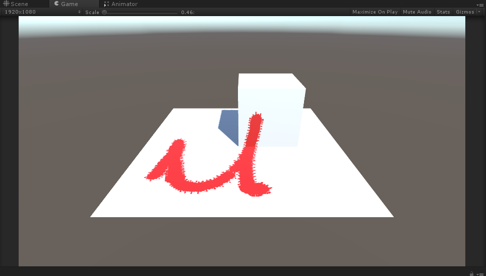
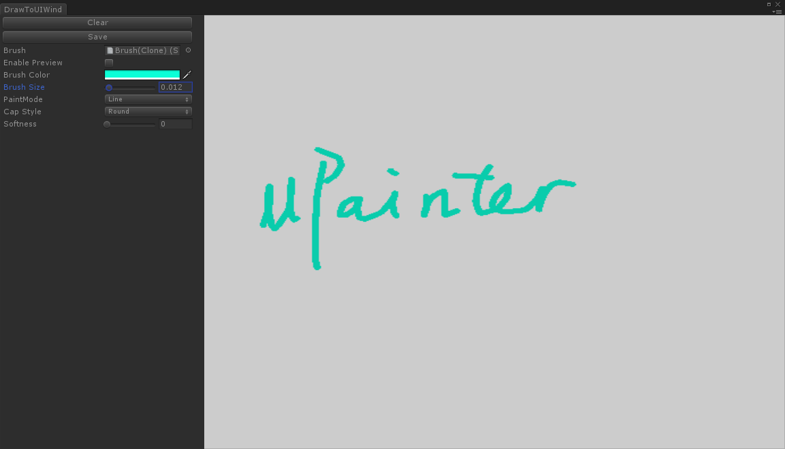

# 1. Introduction
> You can use right now on:  
> [Online Demo](https://wingcd.github.io/upainter-demo/samples/)

This is a texture paint toolset,you can use in Unity RawImage/Mesh Texture/Unity Edtior UI/other UI system;

  </img>
 Raw Image

  </img>
 Draw on mesh

  </img>
 Draw in editor

## Features
* Paint in runtime
* Paint in editor mode
* Paint in GPU
* Solid brush
* Texture brush
* Graphic brush
* Composite brush
* Fill Tool
* More blend type
* Post effect
* Undo/Redo
# 2. Quick Start
## Use Samples
* Open demo scene "uPainter/Samples/Samples.unity" 
* Click one sample
* Draw on canvas
## Create Scene 
* Create a new scene
* Add a RawImage, and stretch to fit size
* Add RawImagePaintCanvas to this 
* Create a solid brush:in assets window, click right mouse button, select in path "Create/uPainter/SolidBrush"
* Modify brush's attributes
* Assign the solid brush to RawImagePaintCanvs's "Brush" property
* Draw on canvas
# 3. How To Use
## Solid brush
## Texture brush
## Graphic brush
## Composite brush
## Post effect
## Undo/Redo