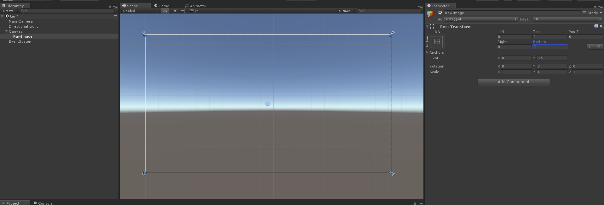
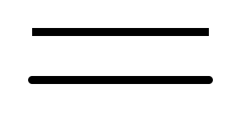
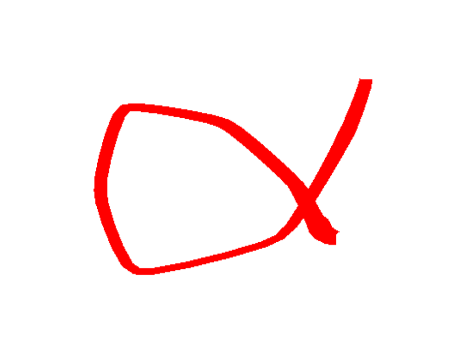

# 1. Introduction
> Get on:  
> [Sales on Unity Assets Store](http://u3d.as/1L3t)  
> Experience right now on:  
> [Online Demo](https://wingcd.github.io/upainter-demo/samples/)

This is a texture paint toolset,you can use in Unity RawImage/Mesh Texture/Unity Edtior UI/other UI system;
<div align=center>
 
 <br/>
 Raw Image
</div>

<div align=center>
 
 <br/>
 Draw on mesh
</div>

<div align=center>
 
 <br/>
 Draw in editor
</div>

## Features
* Paint in runtime
* Paint in editor mode
* Paint in GPU
* Solid brush
* Texture brush
* Graphic brush
* Composite brush
* Fill Tool
* More blend type
* Post effect
* Undo/Redo
# 2. Quick Start
## Use Samples
* Import uPainter package into your project
* After compiled, click menu "uPainter/AddSamples" to add samples scenes to Build Setting, ensure you can run the samples correctly
* Open demo scene "uPainter/Samples/Samples.unity" 
* Click one sample
* Draw on canvas
* Editor sample just click menu "uPainter/EditorDemo"
## How to use 
* Create a new scene
* Add a Empty Object in Canvas, and stretch to fit size
<div align=center>
 
 <br/>
 Create Empty GameObject
</div>

* Add RawImagePaintCanvas to this 
<div align=center>
 
 <br/>
 Add RawImagePaintCanvas component
</div>

* Create a solid brush:in assets window, click right mouse button, select in path "Create/uPainter/SolidBrush"
* Modify brush's attributes
<div align=center>
 
 <br/>
 Create solid brush
</div>

* Assign the solid brush to RawImagePaintCanvs's "Brush" property
* Draw on canvas
<div align=center>
 
 <br/>
 Assign brush & Draw
</div>

# 3. Details Introduce
## Solid brush 
Paint solid color to texture
<div align=center>
 
 <br/>
 Solid brush
</div>

> <b>Brush Color:</b> color of brush  
> <b>Size:</b> size of brush,value Range(0,1) 
>  
> <div align=center>  
>   
> <br/>  
> Brush Size 
> </div> 
> 
> <b>Point Distance Interval:</b> the minimum distance of last two points  
> <b>Self Overlay:</b> whether or not overlay self in on paint life circle    
> <div align=center>  
>   
> <br/>  
> Self Overlay  
> </div>  
>  
> <b>Blend Mode:</b> blend type with layer texture
> * Normal: Default mode  
> * Restore: Easer use this mode  
> * Replace: Scratch card use this mode  
> * Darken  
> * Mutipy  
> * ColorBurn  
> * LinearDark  
> * Lighten  
> * ColorScreen  
> * ColorDodge  
> * LinearDodge  
> * Overlay  
> * HardLight  
> * SoftLight  
> * VividLight  
> * PinLight  
> * LinearLight  
> * HardMix  
> * Difference  
> * Exclusion  
> * Subtract  
> * Add  
>  
> <div align=center>  
>   
> <br/>  
> Some blend modes  
> </div> 
>  
> <b>Pixel Mode:</b> If true, the input uv will be modify clamp to pixel cell,  the layer filter mode must be point, then can get perfect effect, and you need set a correct layer and brush size    
> <div align=center>  
>   
> <br/>  
> Pixel mode  
> </div> 
>  
> <b>Softness:</b> softness of brush,useful highlight effect, value Range(0,1),default is 0    
> <div align=center>  
>   
> <br/>  
> Softness
> </div> 
>  
> <b>Noise Rate:</b> mask brush with noise, can use this property to simulation uneven effect,such as crayon pen, only value bigger than 0 can be effective,value Range(0,1)  
> <b>Noise Size:</b> set the noise size, only noise rate bigger than 0 can be effective,value Range(0,1)  
> 
> <div align=center>  
>   
> <br/>  
> Noise
> </div> 
>  
> <b>Paint Mode:</b> Brush paint mode, has Dash/Line mode
> 
> <div align=center>  
>   
> <br/>  
> Paint Mode
> </div> 
>  
> <b>Cap Style:</b> Brush cap styles, has Flat/Round mode
> 
> <div align=center>  
>   
> <br/>  
> Cap Style
> </div> 
>  
> <b>Line Joint Style:</b> The corner style just effect in line paint mode, has Round/Flat/Sharp mode
> 
> <div align=center>  
>   
> <br/>  
> Line Joint Style
> </div> 
>  

## Texture brush
Paint texture to target texture

<div align=center>  
  
<br/>  
Texture brush
</div> 

> <b>Brush Texture:</b> The brush texture  
> <b>Rotate Angle:</b> Anticlockwise angle in degree of brush texture  
> 
> <div align=center>  
>   
> <br/>  
> Rotate 30 degree
> </div> 
>  
> <b>Rotate Fllow Direction:</b> When in dash mode, the texture will rotate by the direction between two points  
> <b>Tilling:</b> Repeat count of texture, when enable global uv,the tilling means global repeat count,Range(0,1)
> 
> <div align=center>  
>   
> <br/>  
> Tilling sample
> </div> 
>  
> <b>Offset:</b> Offset of texture uv,Range(0,1)
> 
> <div align=center>  
>   
> <br/>  
> Offset sample
> </div> 
>  
> <b>Enable Gloable UV:</b> Use global texture uv,effected by brush size,can use to mosaic effect
> 
> <div align=center>  
>   
> <br/>  
> Enable gloabl uv
> </div> 
>  
> <b>Enable Gloable Reapeat Count:</b> If true, will ignore brush size, only effected by tilling value
> 
> <div align=center>  
>   
> <br/>  
> Global reapeat
> </div> 
>  
> 
> <div align=center>  
>   
> <br/>  
> Global reapeat & set tilling
> </div> 
>  
> <div align=center>  
>   
> <br/>  
> Global reapeat & set offset 
> </div> 
>  

## Graphic/Line brush
Use GL mode to draw lines,can paint lines to texture
<div align=center>  
  
<br/>  
Texture brush  
</div> 

> <b>Line Count:</b> The count of lines  
> 
> <div align=center>  
>   
> <br/>  
> Line count is 4
> </div> 
>  

## Composite brush
This is a brush group effect brush,can overlay many brush effect in one paint
<div align=center>  
  
<br/>  
Composite brush  
</div>

> <b>Brushes:</b> Composite's sub brushes, overlay order by array index
> 
> <div align=center>  
>   
> <br/>  
> Composite brush
> </div> 
>  

## Post effect
When paint done, post effect will process the texture, add effect to the result,the effect can be multiple in brush, inner effect has:
> * <p>Blur Brush Post</p>  
> * <p>Outline Brush Post</p>  
<div align=center>  
  
<br/>  
Post effect  
</div>

## Drawer
<div align=center>  
  
<br/>  
Drawer 
Painter interaction proxy, will handle touch input, we use drawer to create more texture painter, like raw image drawer, other ui system drawer and mesh drawer(need mesh collider)

> <b>Replace Brush:</b> When canvas is empty, this property will set to canvas brush  
> <b>Show Preview:</b> If true, will show cursor on texture  
> <b>Simulate Pressure:</b> If true, will simulate the pressure, distance between two points is more larger ,the size will more small;  
> There has interface to extend, you owen simulate method, even use real touch sensor data;    
> 
> <div align=center>  
>   
> <br/>  
> Simulate pressure
> </div> 
>  
> <b>Brush Pressure Strength:</b> The strength of pressure, the value is more larger, the line will more thinner, value range(0,1)    
> <b>Corner Smooth:</b> Corner smooth strength, value range(0,0.5)  
> <b>Use Shader Smooth:</b> If true, use shader bezier curve, or calucate in cpu, Graphic/Line Brush do not support shader smooth  
> <b>Curve Interpolation:</b> Only when do not use shader smooth mode, will decide how many segments number of the bezier curve, the value is larger, the line will more smooth, and need more caculation,value range(0,5)  

## Undo/Redo 
PainterOperation is a undo/redo system, default max undo/redo step is 10, you can extend this system to save command result to disk,so you can use limitless undo/redo operate;  
Sample undo/redo code:

```csharp
PainterOperation.Instance.Undo()
PainterOperation.Instance.Redo()
```